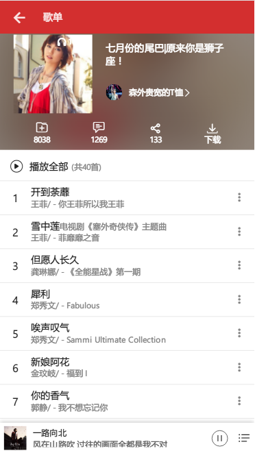
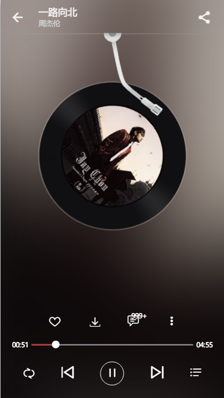
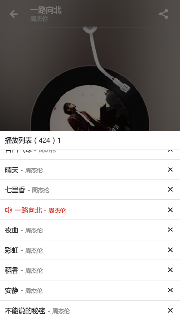
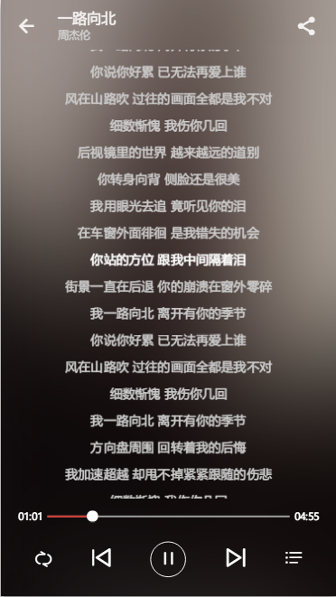
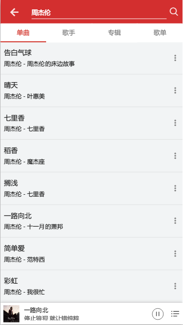

# vue版网易云音乐

> api：ap使用的是一个开源的nodejs封装的网易云音乐api，[地址](https://binaryify.github.io/NeteaseCloudMusicApi/#/?id=%e5%ae%89%e8%a3%85)

> [预览地址](http://39.108.14.248/music)

## 使用步骤

``` bash
# 下载
git clone git@github.com:tgxhx/vue-music.git

# 安装依赖
npm install

# 运行开发环境
npm run dev

# 构建生产环境
npm run build

```

## 技术栈
 + vue2：基础框架
 + vue-router2：路由跳转 
 + vuex：全局数据管理
 + es6：采用部分es6特性，大大简化了写法 
 + webpack：vue-cli基于webpack，修改了部分配置
 + axios：基于Promise的http库，用来请求数据
 + scss：写起css来十分方便，需要安装sass-loader，另外使用自定义其中的自定义函数配合rem来适配移动端设备简直不要太方便
 + flex：弹性布局，在移动端兼容性较好，写各种布局非常方便
 + [vue-material](https://github.com/vuematerial/vue-material)：一个Android上material design风格的组件库

## 说明
1. 这个项目大小组件大概二十几个，目前还未完工，以后还会继续更新，目标是还原整个网易云音乐。
2. 关于路由，刚开始设计路由的时候想了很多，由于一开始的目标就是网易云音乐的所有内容，所以设计了三级路由，/root/index/recommed，大概这样（虽然不知道什么时候能填完坑o(╯□╰)o）。
3. 关于体会，写到这个项目也算是对vue全家桶比较熟了，体会就是，不论是简单的复杂的项目，只要分割成一个个组件再拼起来，也没什么难的，组件之间通信又有vuex，也是非常简单的，总之就是熟能生巧。
4. 关于难点，对于自己来说，audio标签以前没有接触过，有点麻烦，不过还算有相关文档；歌词滚动，部分歌曲还是有点问题，待解决。播放器背景图，这个当时考虑了很久，因为网易云音乐的播放器背景图就是当前歌曲的专辑图，还是模糊效果，最后实现方式是在当前组件的二级div设置当前歌曲的背景图，大小覆盖父元素，为防止第一次播放或者切歌的时候没有图，在组件的根元素也设置一张背景默认图，具体可以[点击查看](https://github.com/tgxhx/vue-music/blob/771218f2929de6b64a34c62597777a4fc0b6ed6e/src/components/Player.vue)
5. 关于打包后的资源路径，比如要放在二级目录www.xxx.com/music，那么修改config/index.js中的assetsPublicPath: '/music/'即可


## 功能
- [x] 首页歌单推荐
- [x] 歌单详情
- [x] 播放器
- [x] 播放暂停
- [x] 播放模式切歌
- [ ] 歌词滚动（待修改）
- [x] 歌曲拖动
- [x] 播放底部背景
- [x] 播放底栏
- [x] 底栏歌曲同步
- [x] 播放列表
- [x] 歌曲评论
- [x] 搜索推荐
- [x] 搜索分类

## 部分截图




